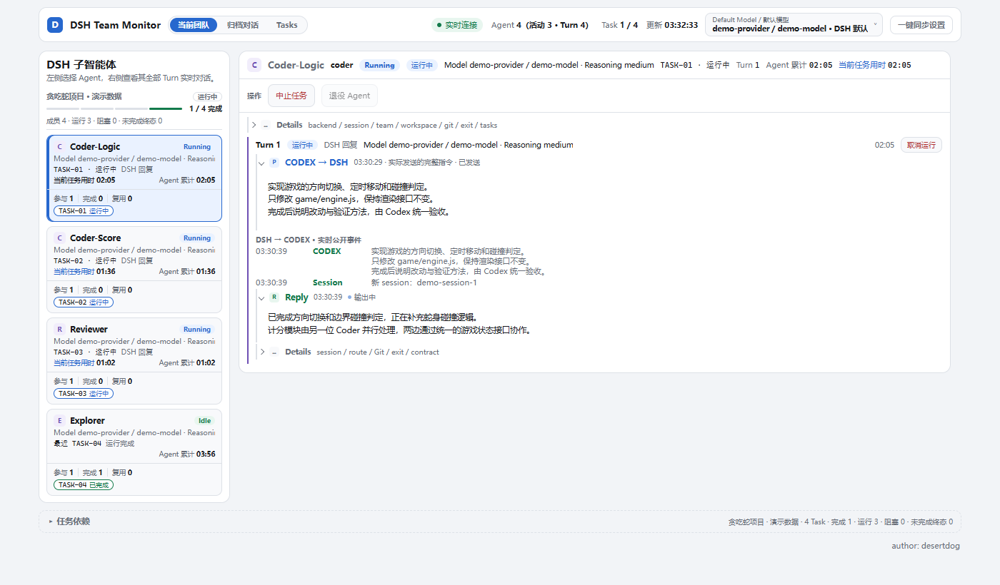
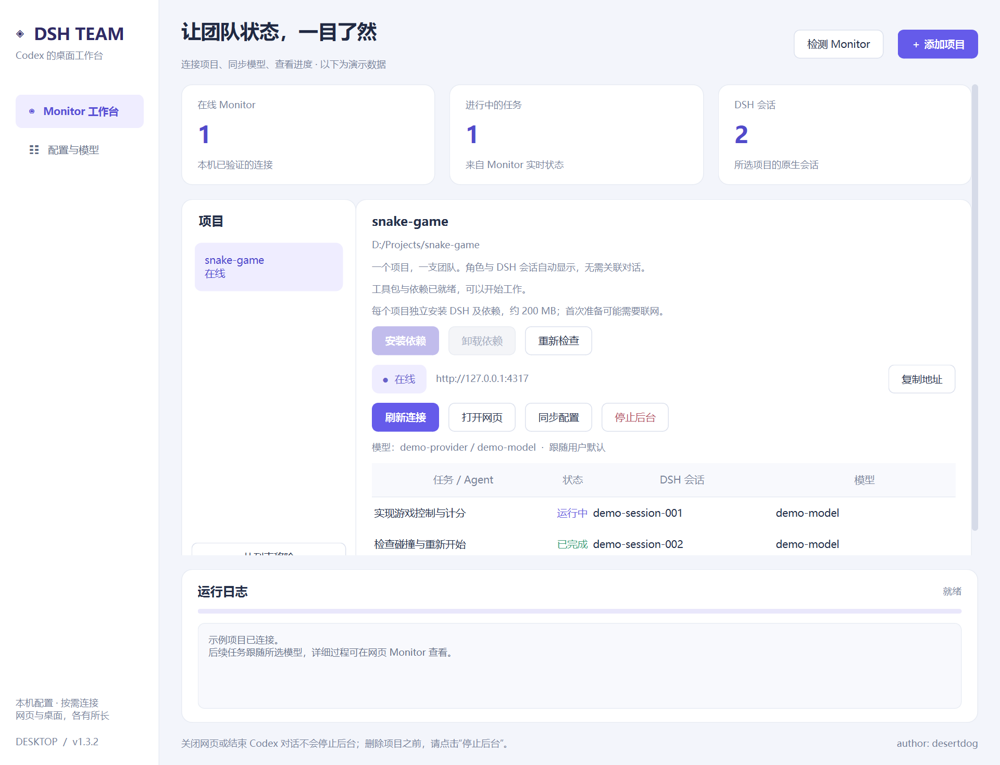

# Codex × DSH Team

[English](README.md) · **简体中文** · Windows 桌面版

## Codex 带队，DSH 分担。

**把宝贵的 Codex 额度留给规划、协调和验收。** 将适合的代码编写、问题排查和代码审查交给 DSH，用你选择的外部模型分担繁琐工作，帮助节省 Codex 额度，让项目继续往前走。

Codex 负责拆任务、带团队、把关结果；DSH 负责执行分配给它的工作。你可以选择价格更合适的模型，桌面控制台帮你完成项目连接、配置同步和进度查看。工具包还包含独立的通用多角色 Skill，不接入 DSH 也能使用。

**[下载 Windows 版 v1.3.3](https://github.com/dogdesert633-cmd/codex-with-dsh-team/releases/download/v1.3.3/codex-dsh-desktop-v1.3.3-windows-x64.zip)** · [查看发布页](https://github.com/dogdesert633-cmd/codex-with-dsh-team/releases/tag/v1.3.3) · [安装说明](docs/INSTALLATION.md)

> **安装前请了解：每个项目会单独安装一份 DSH 及运行依赖，约 200 MB。** 首次准备可能需要联网。它不会覆盖你原本的 DSH；各项目分别安装，不共用这份依赖。安装记录、npm 缓存和任务数据会额外占用空间。

## 团队正在做什么，一眼就能看到



**4 个 Agent · 3 个运行中 · 1 个任务已完成。** 左侧切换成员，右侧查看任务指令、回复和运行时间。截图来自实际 Monitor 页面，任务、模型与会话均为演示数据。

## 桌面控制台：安装、配置与项目管理



*实际程序界面，任务与模型为演示数据。*

## 你可以用它做什么

- **把工作拆给不同角色。** 探索、实现、审查各有分工，由 Codex 汇总结果并最终验收。
- **用外部模型分摊额度消耗。** 把适合的编码与审查交给 DSH，减少这部分工作对 Codex 额度的消耗；供应商、模型和预算由你选择。
- **在一个窗口管理项目。** 自动检查安装状态，分别安装依赖、启动或停止 Monitor；一个项目一支团队，无需手动关联对话。
- **看清工作进行到哪里。** 桌面展示项目和会话概览，网页 Monitor 展示详细任务、事件和日志。

外部模型调用按你的供应商规则计费；分工的效果与费用取决于任务和所选模型。

## 几步开始

准备 Windows 10/11、Node.js ≥ 22.19.0，以及已配置好模型和凭据的 DSH。桌面程序自带所需 GUI 环境，无需安装 Python；空白项目目录也可以使用，无需先创建 Git 仓库。

1. 下载上方 ZIP，**完整解压**，双击 `CodexDshDesktop.exe`。保留旁边的 `_internal` 和 `toolkit` 文件夹。
2. 在“配置与模型”点击 **自动查找 DSH 配置**，确认供应商和模型；找不到时再手动选择配置目录。
3. **添加项目 → 安装工具包与依赖 → 启动 Monitor**。安装进度和结果都会显示在窗口中。
4. 在 Codex 中打开同一个项目，发送下面的提示，并替换最后一行的任务：

```text
请读取以下三个 Skill：
.agents/skills/codex-team/SKILL.md
.agents/skills/dsh-role-boundaries/SKILL.md
.agents/skills/mcp-to-dsh/SKILL.md
由你协调和最终验收，让 DSH 分担适合的探索、实现与审查工作。
我的任务：做一个可以重新开始、显示分数的贪吃蛇小游戏。
```

请下载发布页的桌面 ZIP；GitHub 自动生成的 `Source code` 归档不包含可直接运行的 EXE。

## 三个 Skill，按需使用

| Skill | 负责什么 |
| --- | --- |
| `codex-team` | 通用多角色团队规则：拆分任务、分配角色、独立审查与返修。可单独使用，无需 DSH。 |
| `dsh-role-boundaries` | DSH 的能力与角色边界；绘图、识图及视觉判断等任务留给具备相应能力的 Codex。 |
| `mcp-to-dsh` | DSH 调用与本地 Monitor，展示任务过程和会话状态。 |

三个 Skill 独立，按任务选择读取。只想用团队规则时，让 Codex 读取 `codex-team/SKILL.md` 即可，无需安装 DSH 运行依赖。

## 安装到哪里，如何移除

DSH 及其依赖安装在项目的 `.agents/skills/mcp-to-dsh/node_modules/`。当前依赖树约有 2.5 万个文件，内容大小实测约 214 MiB，主要是 DSH 模块、多供应商 SDK 及它们的依赖。这是上方“约 200 MB”的统计范围，不是完整安装后的总占用。

你原本的 DSH 安装和配置保持不变；工具包从你选择的配置来源同步到自己的受管运行目录。安装不会改写项目的 `AGENTS.md` 或系统 `PATH`。

结束工作时点击 **停止后台**。关闭网页或结束 Codex 对话不会停止后台服务。

要移除工具包，先停止后台，再运行项目根目录的 `CodexDshTeamToolkit.Uninstall.exe`。卸载会清理已登记且未修改的工具包与依赖，保留你修改、新增的文件和任务记录，并显示保留原因。旧版或手动安装、没有原始内容记录的依赖会保留。只想移除依赖时，也可以在桌面点击“卸载依赖”。

DSH 会调用你配置的模型服务，并可执行命令、读写项目文件；请确认任务内容适合交给该服务。详见[安全说明](docs/SECURITY.md)。

## 更多帮助

[完整安装说明](docs/INSTALLATION.md) · [桌面使用指南](https://github.com/dogdesert633-cmd/codex-with-dsh-team/blob/main/desktop/README.md) · [配置说明](docs/CONFIGURATION.md) · [常见问题](docs/TROUBLESHOOTING.md) · [更新日志](CHANGELOG.md)

当前为预发布版本，欢迎在 [Issues](https://github.com/dogdesert633-cmd/codex-with-dsh-team/issues) 反馈使用中遇到的问题。

## 作者与致谢

**author: desertdog**

开发过程中参考了 [NanmiCoder/dsh-agent-teams](https://github.com/NanmiCoder/dsh-agent-teams)。感谢作者与贡献者公开分享 DSH 多代理团队的设计和实现。

原工具包采用 [MIT](LICENSE)；桌面控制台采用 [GPL-3.0](https://github.com/dogdesert633-cmd/codex-with-dsh-team/blob/main/desktop/LICENSE)。
